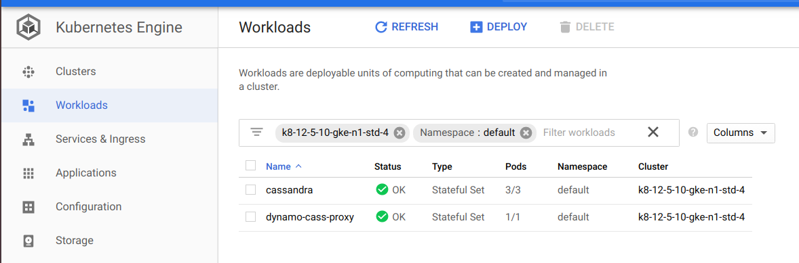

# dynamo-cassandra-proxy

Build state:


`dynamo-cassandra-proxy` consists of a scalable proxy layer that sits between your app and Apache Cassandra. [See the design summary in docs](docs/Summary.md)

It provides compatibility with the DynamoDB SDK which allows existing DynamoDB applications to read and write data to Cassandra without application changes.

It also supports the ability to sync DynamoDB tables with cassandra via DynamoDB Streams.

## Config

Create your yaml based on the template:

    cp conf/dynamo-cassandra-proxy.yaml.template conf/dynamo-cassandra-proxy.yaml

The following are the options supported by the proxy:

| Option | Description|
| ------ | ---------- |
|streamsEnabled| When set to true it enables the proxy to pull live data from an existing dynamodb table| 
|dynamoRegion| Only needed when streaming is enabled, region your dynamodb table is in |
|dyanmoAccessKey| Only needed when streaming is enabled, used to connect to dynamodb streams|
|dyanmoSecretKey| Only needed when streaming is enabled, used to connect to dynamodb streams|
|awsDynamodbEndpoint| Only needed when streaming is enabled, used to connect to dynamodb streams|
|contactPoints| Contact points to connect to Apache Cassandra(TM) cluster. If you are using the docker option just leave localhost|
|dockerCassandra| When set to true it will stand up Cassandra in your local docker. Ensure the docker deamon is installed and running and your user has access to run `docker ps`|


## To run locally

Clone:

    git clone git@github.com:datastax/dynamo-cassandra-proxy.git

Build:

    mvn package

Run the app: whether you point the proxy at your own c* cluster or you rely on the proxy to stand up a cassandra node using the cassandraDocker option in the yaml. You can run the code locally by:

    java -Ddw.contactPoints="$contactPoints" -cp target/dynamodb-cassandra-proxy-0.1.0.jar com.datastax.powertools.dcp.DCProxyApplication server conf/dynamo-cassandra-proxy.yaml

The proxy will come up and listen on port :8080. In your dynamodb application, just point your app to `<host>:8080` in the SDK. A sample connection string (in Java) should look as follows:

            ClientConfiguration config = new ClientConfiguration();
            config.setMaxConnections(dynamodbMaxConnections);;
            String dynamodbEndpoint = "localhost:8080"
            String signinRegion = "dummy"
            AwsClientBuilder.EndpointConfiguration endpointConfiguration = new AwsClientBuilder
                    .EndpointConfiguration(protocol + "://" + dynamodbEndpoint, signinRegion);
            ddbBuilder = AmazonDynamoDBClientBuilder.standard()
                    .withClientConfiguration(config)
                    .withEndpointConfiguration(endpointConfiguration);


Note, `MaxConnections` is the main lever to get the AWS SDK to perform beyond very basic levels. We have tested this up to the maxium of 50 and it appears to scale almost linearly all the way up on a medum sized box. If you are doing some benchmarking and are looking to try to saturate a cassandra cluster, crank this value up.

## To run via docker-compose

Build the app

    mvn package
    
Build and run the docker containerst st
    
    docker-compose up


## To run in local k8s

Set up cassandra config map:

    kubectl create configmap cassandra-config \
--from-file=common/cassandra/conf-dir/resources/cassandra/conf 

Apply k8s yaml:

    kubectl apply -f k8s-local/proxy-suite.yaml 

At this point, your pods should look as follows:

```
$ kubectl get pods                                                                                     [2:34:13]
NAME                  READY   STATUS              RESTARTS   AGE
cassandra-0           1/1     Running             0          2m35s
cassandra-1           1/1     Running             0          168s
cassandra-3           1/1     Running             0          123s
dynamo-cass-proxy-0   1/1     Running             4          63s
```

To terminate your deploymet run:

    kubectl delete -f k8s-local/proxy-suite.yaml 

## To run on GKE

Set up configMap

    kubectl create configmap cassandra-config \
        --from-file=common/cassandra/conf-dir/resources/cassandra/conf

Apply k8s yaml:

    kubectl apply -f gke/proxy-suite.yaml 

The workload will appear on your google console like so (ensure you're viewing the right project):



To terminate your deploymet run:

    kubectl delete -f gke/proxy-suite.yaml 


## Contributing

A good place to start might be fleshing out your own Translator.
For details on translators see [Translators in the docs](docs/Translators.md)

## MVP Roadmap:

Check means currently completed:

 - [x] CreateTable - Done in json_blob
 - [x] DeleteItem - Done in json_blob
 - [x] DeleteTable - Done in json_blob
 - [x] GetItem - Done in json_blob
 - [x] PutItem - Done in json_blob
 - [x] Query - key condition expression (json_blob)
 - [x] Query - key conditions (json_blob)
 - [x] Query - filter expressions (json_blob)
 - [ ] Query - projection expressions (json_blob)
 - [ ] Query - limit (json_blob)
 - [ ] Query - withSelect (json_blob)
 - [ ] Scan
 - [x] Hybrid functionality - DDB to Cassandra
 - [ ] Hybrid functionality - Cassandra to DDB

**Other features** not yet implemented:

- UpdateItem
- BatchGetItem
- BatchWriteItem
- DescribeStream
- DescribeTable
- DescribeLimits
- DescribeTimeToLive
- GetRecords
- GetShardIterator
- ListStreams
- ListTables
- ListTagsOfResource
- TagResource
- UntagResource
- UpdateTable
- UpdateTimeToLive
- ConsistentRead

## License
This project is licensed under the Apache Public License 2.0
