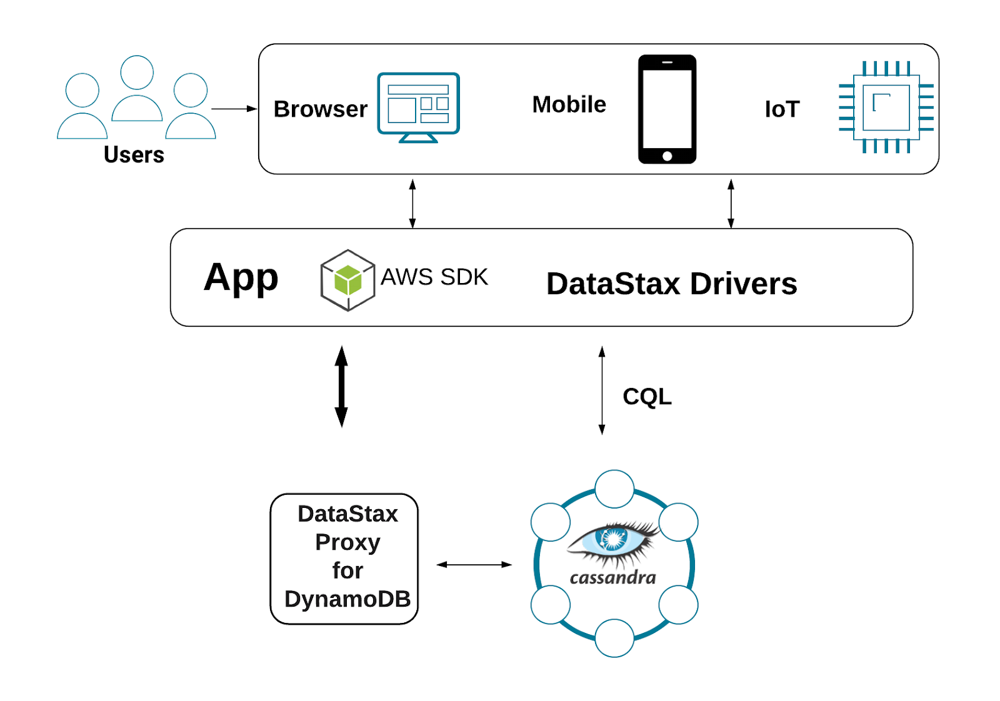
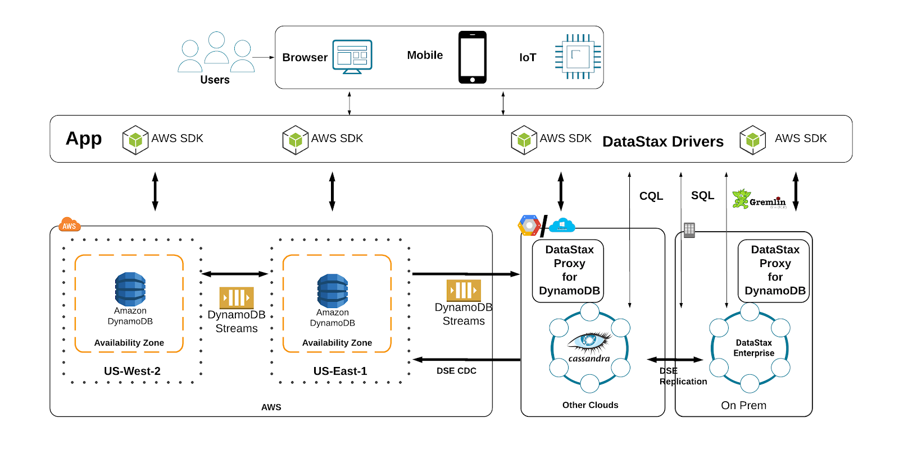

## Running existing DynamoDB applications on a Cassandra cluster

Many developers build on premises and then deploy to the cloud for production. The proxy enables customers to run their existing DynamoDB applications using Cassandra clusters on-prem. 

## Live replication of DynamoDB applications to Cassandra 

DynamoDB Streams can be used to enable hybrid workload management and transfers from DynamoDB cloud deployments to on-prem Cassandra-proxied deployments. This is supported in the current implementation and, like DynamoDB Global Tables, it uses DynamoDB Streams to move the data. For hybrid transfer to DynamoDB, check out the Cassandra CDC improvements which could be leveraged and stay tuned to the DataStax blog for updates on our Change Data Capture (CDC) capabilities. 

## What's in the Proxy?
The proxy is designed to enable users to back their DynamoDB applications with Cassandra. We determined that the best way to help users leverage this new tool and to help it flourish was to make it an open source Apache 2 licensed project.
The code consists of a scalable proxy layer that sits between your app and the database. It provides compatibility with the DynamoDB SDK which allows existing DynamoDB applications to read and write data to Cassandra without application changes.

## How It Works

A few design decisions were made when designing the proxy. As always, these are in line with the design principles that we use to guide development for both Cassandra and our DataStax Enterprise product.

## Why a Separate Process?

We could have built this as a Cassandra plugin that would execute as part of the core process but we decided to build it as a separate process for the following reasons:
 - Ability to scale the proxy independently of Cassandra
 - Ability to leverage k8s / cloud-native tooling
 - Developer agility and to attract contributors—developers can work on the proxy with limited knowledge of Cassandra internals
 - Independent release cadence, not tied to the Apache Cassandra project
 - Better AWS integration story for stateless apps (i.e., leverage CloudWatch alarm, autoscaling, etc.)

## Why Pluggable Persistence?

On quick inspection, DynamoDB's data model is quite simple. It consists of a hash key, a sort key, and a JSON structure which is referred to as an item. Depending on your goals, the DynamoDB data model can be persisted in Cassandra Query Language (CQL) in different ways. To allow for experimentation and pluggability, we have built the translation layer in a pluggable way that allows for different translators. We continue to build on this scaffolding to test out multiple data models and determine which are best suited for:

- Different workloads
- Different support for consistency / linearization requirements
- Different performance tradeoffs based on SLAs
